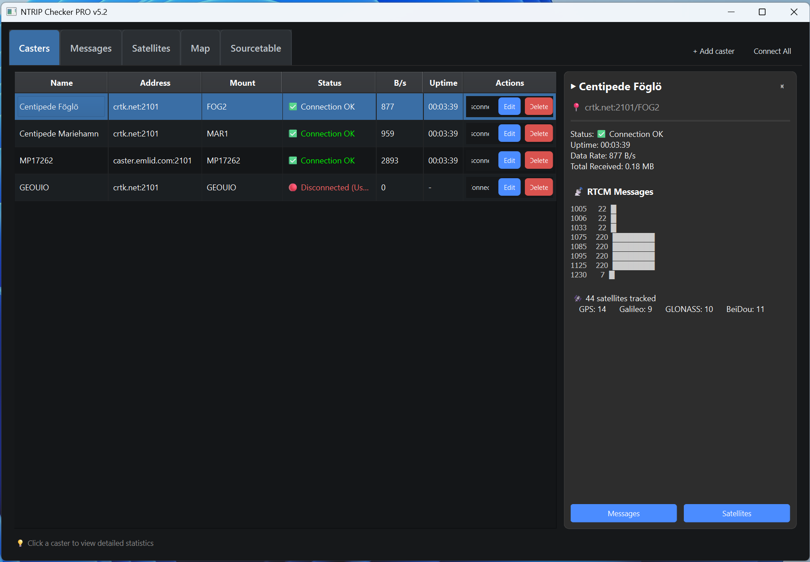
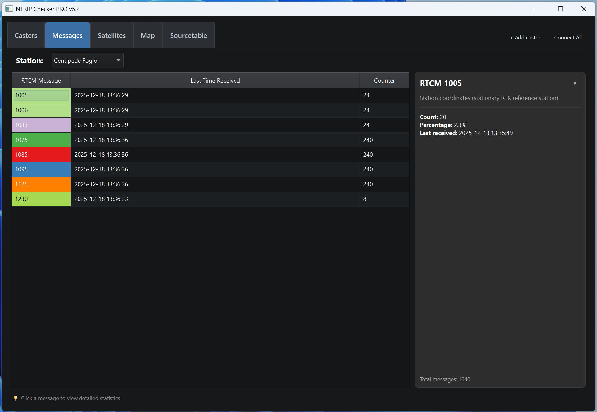
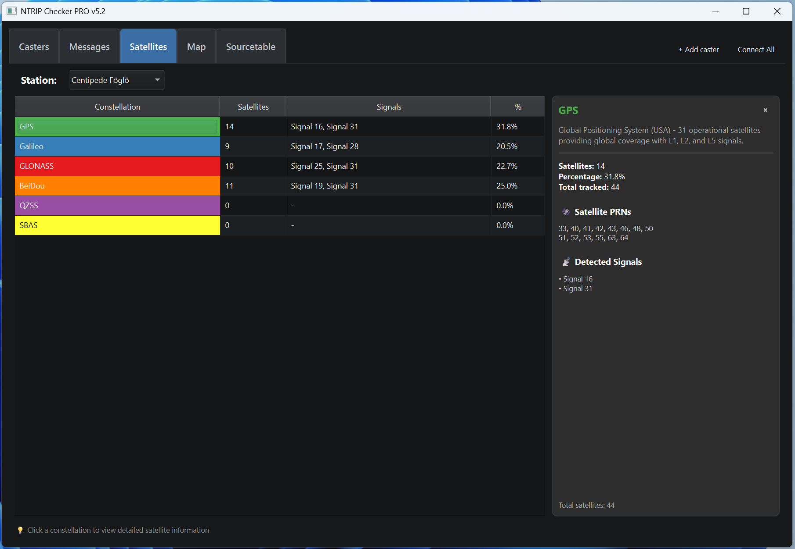
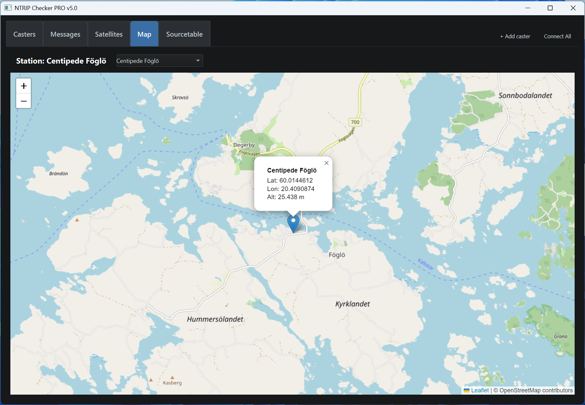
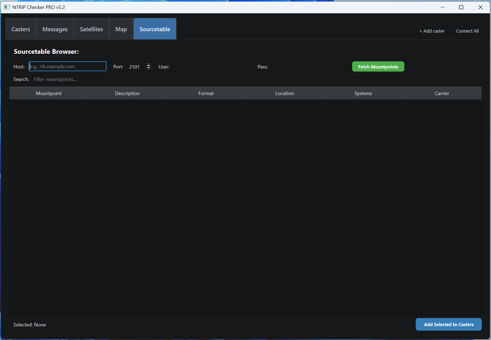

# NTRIP Checker PRO v5.2

A professional GNSS NTRIP client application for monitoring and analyzing NTRIP caster streams. Built with PyQt6, provides real-time data visualization, RTCM message statistics, interactive mapping with RTK coverage visualization, and automatic mountpoint discovery from NTRIP casters.

## Features

✅ **Multi-Caster Management** — Add, edit, and remove multiple NTRIP casters  
✅ **Sourcetable Browser** — Automatically discover and add mountpoints from any NTRIP caster  
✅ **Real-Time Monitoring** — Live byte rate (B/s) and uptime tracking  
✅ **Satellite Tracking** — Real-time GNSS constellation monitoring (GPS, GLONASS, Galileo, BeiDou, QZSS, SBAS)  
✅ **RTCM Message Analysis** — Parse and visualize RTCM message types with constellation-colored MSM messages  
✅ **Interactive Mapping** — Leaflet-based map with real-time updates and 20 km RTK coverage circles  
✅ **Detail Panels** — Context-sensitive panels on all tabs showing real-time statistics  
✅ **Real-Time Map Popups** — Auto-updating popups showing live status, data rate, satellites, and RTCM messages  
✅ **Dark Theme UI** — Modern dark interface with excellent contrast and readability  
✅ **Data Persistence** — Caster configurations saved to JSON  
✅ **User-Controlled Connections** — Manual connect/disconnect with no auto-reconnect after user stop  
✅ **Logging** — Console and rotating file logging for debugging  
✅ **Cross-Platform** — Windows, Linux, Raspberry Pi support  

## Screenshots

### Casters Tab
View all connected NTRIP streams with status, data rates, and uptime.



### Messages Tab
Real-time RTCM message statistics with constellation-colored donut chart.



### Satellites Tab
Live satellite constellation tracking with interactive donut chart and color-coded cards.



### Map Tab
Geographic visualization of caster locations with detailed popups.



### Sourcetable Tab
Browse and automatically add mountpoints from NTRIP casters with location data.



## Requirements

- **Python 3.8+**
- **PyQt6** (GUI framework)
- **PyQt6-WebEngine** (Interactive map display)
- **pyrtcm** (RTCM message parsing)
- **qt-material** (Modern dark theme)

See `requirements.txt` for full dependency list.

## Installation

### Windows

1. Install Python 3.9+ from [python.org](https://www.python.org/)
2. Clone the repository:
   ```bash
   git clone https://github.com/UserRmM/ntrip-checker-pro.git
   cd ntrip-checker-pro
   ```
3. Install dependencies:
   ```bash
   pip install -r requirements.txt
   ```
4. Run the application:
   ```bash
   python ntrip_checker_pro_v5_2.py
   ```

Or use the provided desktop shortcut (see INSTALL.md).

### Linux / Raspberry Pi

See [INSTALL.md](INSTALL.md) for detailed setup instructions.

## Quick Start

1. **Launch** the application
2. **Add a Caster** (two methods):
   
   **Method A: Manual Entry**
   - Click "+ Add caster"
   - Enter NTRIP server details (Host, Port, Mountpoint, Username, Password)
   - Optionally add Location (Lat/Lon/Alt) for map display
   - Click "Save"
   
   **Method B: Sourcetable Browser** (Recommended)
   - Go to the **Sourcetable** tab
   - Enter caster host, port, and credentials
   - Click "Fetch Mountpoints"
   - Browse available mountpoints with locations
   - Select one or more mountpoints
   - Click "Add Selected to Casters"
   - Coordinates are automatically added from sourcetable

3. **Monitor**:
   - View live connection status and data rates on the **Casters** tab
   - Switch to **Messages** tab to see RTCM message statistics
   - Use the **Satellites** tab to track GNSS constellations
   - Use the **Map** tab to visualize caster locations
4. **Sync Selection**:
   - Select a caster in **Messages** tab — the **Map** and **Satellites** tabs auto-sync

## Configuration

### Caster Storage

All casters are saved in `casters.json` in the application directory:

```json
[
  {
    "name": "Station Name",
    "host": "caster.example.com",
    "port": 2101,
    "mount": "MOUNT_POINT",
    "user": "username",
    "password": "password",
    "lat": 60.1234,
    "lon": 25.5678,
    "alt": 50.0
  }
]
```

#### Custom Casters File Location (Optional)

You can override the default `casters.json` location using the `NTRIP_CASTERS_PATH` environment variable:

**Windows (PowerShell - Permanent):**
```powershell
[System.Environment]::SetEnvironmentVariable('NTRIP_CASTERS_PATH', 'D:\Path\To\Your\casters.json', 'User')
```

**Windows (PowerShell - Temporary):**
```powershell
$env:NTRIP_CASTERS_PATH = "D:\Path\To\Your\casters.json"
python ntrip_checker_pro_v5_2.py
```

**Linux/Mac:**
```bash
export NTRIP_CASTERS_PATH="/path/to/your/casters.json"
python ntrip_checker_pro_v5_2.py
```

**Use Cases:**
- Keep personal caster configurations separate from the repository
- Share casters between multiple installations
- Use different configurations for testing vs production

### Logging

Logs are written to:
- **Console** (INFO level)
- **`ntrip_checker.log`** (INFO level, rotating: 5 MB per file, up to 3 backups)

## Troubleshooting

### Connection Issues
- Verify NTRIP server address and port
- Check firewall/network connectivity
- Review logs in `ntrip_checker.log`

### UI Rendering Issues
- Ensure PyQt6 is properly installed: `pip install --upgrade PyQt6`
- On Linux, may need X11 forwarding for remote display

### RTCM Parsing
- Some incomplete message fragments are silently skipped (expected behavior)
- Check log for parser exceptions

## Development

### Code Structure

- **NTRIPClient**: Threading-based NTRIP connection handler with auto-reconnect
- **NTRIPCheckerPro**: Main GUI class, handles UI and data aggregation
- **Signals**: PyQt signals for thread-safe GUI updates
- **Helper Functions**: Color mapping, SVG chart generation, time formatting

### Threading Model

- Each NTRIP caster runs in a daemon thread (non-blocking)
- Data parsing happens in the main GUI thread (thread-safe)
- Per-caster buffering with locks ensures concurrent access safety

## Future Enhancements

- [ ] Configuration profiles (save/load multiple setups)
- [ ] Export statistics to CSV/JSON
- [ ] Web-based dashboard (Flask backend)
- [ ] Alerts for connection loss / data anomalies
- [ ] DGPS/RTK solution visualization

## License

MIT License — See [LICENSE](LICENSE) file for details.

## Contributing

Contributions welcome! Please:
1. Fork the repository
2. Create a feature branch
3. Commit your changes
4. Push and open a Pull Request

## Support

For issues, questions, or suggestions, please open a [GitHub Issue](https://github.com/UserRmM/ntrip-checker-pro/issues).

## Changelog

See [CHANGELOG.md](CHANGELOG.md) for version history and updates.

---

**Version:** 5.1  
**Last Updated:** December 2025
